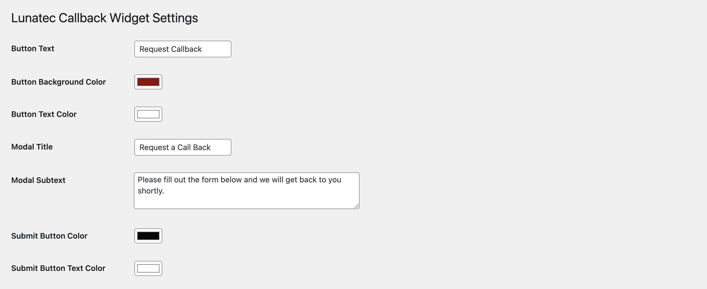

# Lunatec Callback Widget

A simple and customizable WordPress plugin that allows visitors to request a callback via a floating button and a modal form.

## Description

**Lunatec Callback Widget** adds a floating button to your WordPress site. When clicked, it opens a clean, responsive modal form where visitors can leave their name, phone number, and other details to request a call back.

The plugin is designed to be lightweight and easy to configure.

### Features

*   **Floating Request Button**: A customizable floating button that stays visible as users scroll.
*   **Modal Form**: A user-friendly popup form for collecting callback requests.
*   **International Phone Support**: Integrated international telephone input with country flags and codes.
*   **Admin Management**: View all callback requests in a dedicated admin dashboard.
*   **CSV Export**: Easily export all requests to a CSV file for external processing.
*   **Customization**:
    *   Change button text and colors.
    *   Customization of modal title and helpful subtext.
    *   Choose button position (bottom-right, bottom-left, top-right, top-left).
    *   **Fine-tuned Positioning**: Adjust the specific X and Y margins for the floating button.
    *   Set modal size (small, medium, large).
    *   Configure submit button colors.
*   **CRM Integration**:
    *   **HubSpot**: Automatically sync valid callback requests to HubSpot CRM as contacts.
*   **Notifications**:
    *   **Slack**: Send notifications to a Slack channel via Webhook.
    *   **Email**: Receive email alerts for every new request.
*   **Shortcode Support**: Use `[lcbw_callback]` to place a trigger button anywhere on your site.

## Installation

1.  Upload the `lunatec-callback-widget` folder to the `/wp-content/plugins/` directory.
2.  Activate the plugin through the 'Plugins' menu in WordPress.
3.  Go to **Lunatec Callback Widget > Settings** to configure the button appearance and form options.
4.  Go to **Lunatec Callback Widget > Requests** to view submissions.

## Usage

### Automatic Floating Button
By default, the plugin adds a floating button to the bottom-right corner of your site. You can disable this or change its position in the settings.

### Shortcode
You can also place a callback request button inside any post or page using the shortcode:

```
[lcbw_callback_button text="Request a Call" class="my-custom-class"]
```

*   `text` (optional): The text to display on the button.
*   `class` (optional): Additional CSS class for styling.

## External Services

This plugin may connect to external third-party services depending on your configuration. Below is a comprehensive list of all external services this plugin uses, what data is transmitted, and under which conditions:

### HubSpot CRM Integration

**What the service is**: HubSpot is a customer relationship management (CRM) platform used for managing contacts and leads.

**What it's used for**: When enabled, this plugin automatically creates or updates contact records in your HubSpot CRM whenever a visitor submits a callback request through the plugin's form.

**What data is sent**: 
- First name and last name (parsed from the full name field)
- Phone number
- Job title/position
- Company name
- Lifecycle stage (automatically set to "lead")

**When data is sent**: Data is transmitted only when:
1. A visitor successfully submits a callback request form
2. HubSpot integration is enabled in the plugin settings
3. A valid HubSpot API key is configured

**Service Provider**: HubSpot, Inc.
**API Endpoint**: https://api.hubapi.com/crm/v3/objects/contacts
**Terms of Service**: https://legal.hubspot.com/terms-of-service
**Privacy Policy**: https://legal.hubspot.com/privacy-policy

### Slack Integration

**What the service is**: Slack is a business communication platform that supports webhook notifications.

**What it's used for**: When enabled, this plugin sends instant notifications to a specified Slack channel whenever a new callback request is submitted, allowing your team to respond quickly to leads.

**What data is sent**:
- Visitor's full name
- Phone number
- Job title/position (if provided)
- Company name (if provided)
- Notification that a new callback request was received

**When data is sent**: Data is transmitted only when:
1. A visitor successfully submits a callback request form
2. Slack integration is enabled in the plugin settings
3. A valid Slack webhook URL is configured

**Service Provider**: Slack Technologies, LLC
**Terms of Service**: https://slack.com/terms-of-service
**Privacy Policy**: https://slack.com/privacy-policy

### Email Notifications

**What the service is**: The plugin uses WordPress's built-in email functionality (`wp_mail()`) to send email notifications.

**What it's used for**: Sends email notifications to site administrators when new callback requests are submitted.

**What data is sent**:
- Visitor's full name
- Phone number
- Job title/position (if provided)
- Company name (if provided)

**When data is sent**: Email notifications are sent only when:
1. A visitor successfully submits a callback request form
2. Email notifications are enabled in the plugin settings
3. A valid notification email address is configured

**Important Note**: Email notifications use WordPress's native `wp_mail()` function and do not directly connect to external services unless your WordPress installation is configured to use external email services (such as SendGrid, Mailgun, etc.). If you have configured WordPress to use external email services, those services' terms and privacy policies would apply.

## Screenshots

### Modal Form


### Modal Form Filled


### Settings Page


## Frequently Asked Questions

**Can I change the position of the floating button?**
Yes, you can choose between Bottom Right, Bottom Left, Top Right, and Top Left in the settings page. You can also fine-tune the positioning with specific X and Y margin values.

**Where is the data stored?**
The data is stored in your WordPress database in a custom table created by the plugin (`wp_lcbw_requests`).

**Does it support international numbers?**
Yes, the input field automatically handles different country codes and formatting using the integrated international telephone input library.

**How do I get a HubSpot API Key?**
Go to your HubSpot Settings > Integrations > Private Apps. Create a new app, select the "crm.objects.contacts.write" scope, and paste the Access Token into the plugin settings.

## Changelog

### 1.0.3
*   **Improvement**: Enhanced documentation and external services disclosure.
*   **Fix**: Minor code improvements and optimizations.

### 1.0.2
*   **New**: Added Slack and Email notification support.
*   **Improvement**: Added status badges (New, Contacted, Closed) to the admin requests list.
*   **Improvement**: Enhanced admin interface with better UX.

### 1.0.1
*   **New**: HubSpot Integration! You can now sync requests directly to HubSpot CRM.
*   **New**: Added "Margin X" and "Margin Y" settings for precise positioning of the floating button.
*   **Fix**: Minor styling adjustments and code refactoring.
